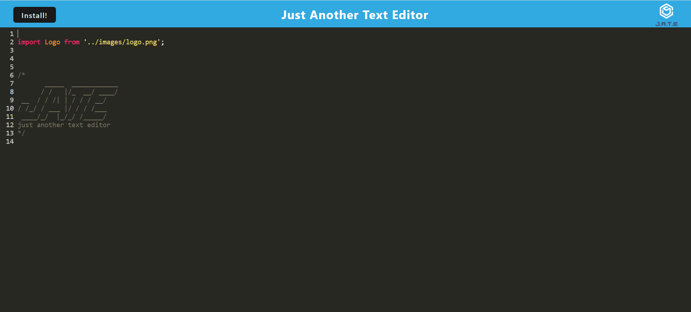

# text-editor

## Description

Task was to build o build a text editor that runs in the browser. This app is a single-page application that meets the PWA criteria. Additionally, it features a number of data persistence techniques that serve as redundancy in case one of the options is not supported by the browser. The application also functions offline.

In this application, I've implemented methods for getting and storing data to IndexedDB database using a package called `idb`, which is a lightweight wrapper around the IndexedDB API. It features a number of methods that are useful for storing and retrieving data, and is used by companies like Google and Mozilla.

I have also added a walkthrough video that demonstrates the functionality of the PWA. A link to the video has been provided in the README below.

## Table of Contents

- [Description](#description)
- [Installation](#installation)
- [Usage](#usage)
- [Technologies Used](#technologies-used)
- [Setup](#setup)
- [Appearance](#appearance)
- [Demo](#demo)
- [Acknowledgements](#acknowledgements)
- [Questions](#questions)
- [License](#license)

## Installation

​Install dependencies using:

    npm install

## Usage

Need to have Node.js installed locally to run the app. Alternatively, please checkout the delployed application on Heroku

The application will then be invoked by using the following command:

    npm run start:dev

## Technologies Used

- Node.js
- IndexedDB
- Service Workers
- Webpack

## Setup

- Nodejs must be installed
- Text editor (VS Code recommended)

## Appearance

## Demo

## Acknowledgements

- https://www.npmjs.com/package/express
- https://www.npmjs.com/package/nodemon
- https://www.npmjs.com/package/concurrently
- https://www.npmjs.com/package/webpack
- https://www.npmjs.com/package/@babel/core

## Questions

Created by: [@moedaaboul](https://github.com/moedaaboul)

Feel free to contact me via [muhammad.daaboul1989@gmail.com](muhammad.daaboul1989@gmail.com)!

## License

This work is licensed under
[MIT](#).
